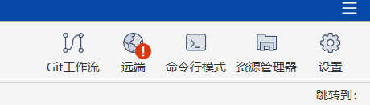
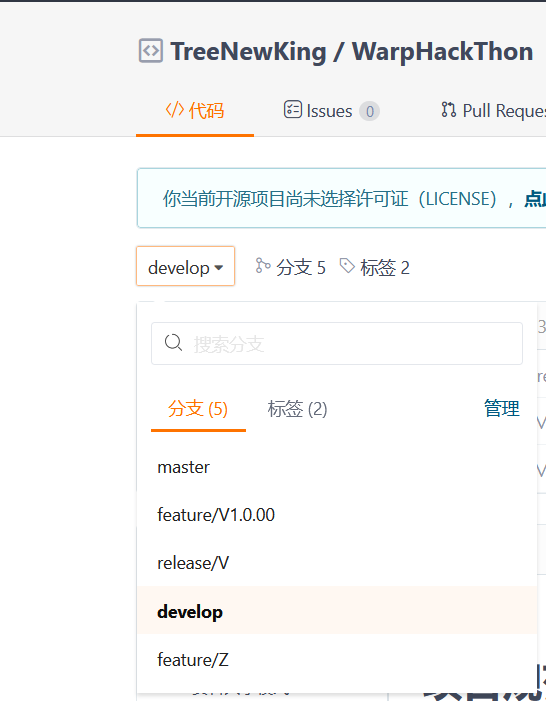

<!--
 * @Author: zhouzheng66 2029054066@qq.com
 * @Date: 2024-05-23 13:14:54
 * @LastEditors: zhouzheng66 2029054066@qq.com
 * @LastEditTime: 2024-05-23 17:06:04
 * @FilePath: /defi_chainreward/README.md
 * @Description: 这是默认设置,请设置`customMade`, 打开koroFileHeader查看配置 进行设置: https://github.com/OBKoro1/koro1FileHeader/wiki/%E9%85%8D%E7%BD%AE
-->

# defi_chainreward

# 项目规范

## 协作模式

协助利用 gitflow 模型，sourcetree 可视化工具进行协作

## 资料共享模式

根目录下的 readme 如需更改先给我说一下

doc 下属于自己的目录随便修改

### 错误的提交

TIP:若修改的部分是自己的目录不涉及到公共部分，可以不按照 gitflow 的模型，直接修改 devlop 分支然后合并到 master 分支然后推送就可以了。

1.绕过 develop 分支而直接修改了 master 分支内容

正确的方式应该是在 sourcetree 中利用 flow 模型的快捷操作模式（git 工作流）进行提交



提交顺序属于自己的 feature 分支->develop 分支->release 分支->master 分支

2.feature 分支和 release 分支不要提交到仓库上，在完成一个功能的开发后，在本地根据 souretree 的快捷键完成 devlop->feature->release->(此时在 release 分支上使用快捷键，souretree 会自动将 release 分支上的更新同时更新到 master 和 devlop 分支上并自动删除 release 分支)。所以最后推送到线上的分支只剩下 master 分支和 devlop 分支



## 目录树（根据项目进度持续更新）

doc->用于保存文档

**注意事项**

```
1.markdown 引用的图片统一存放在md文件所在目录下的img里面 (统一一下不然后面目录可能出问题
2.创建目录之后尽可能的写README文档,特别是一些工程文件的启动方法等。
```

#
